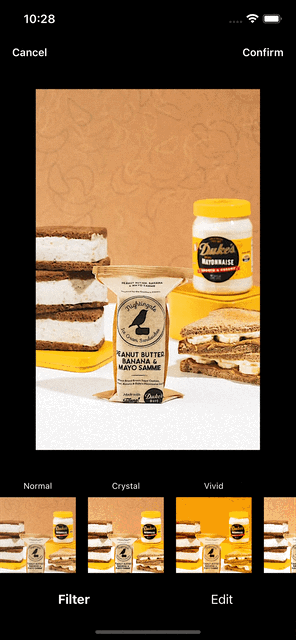
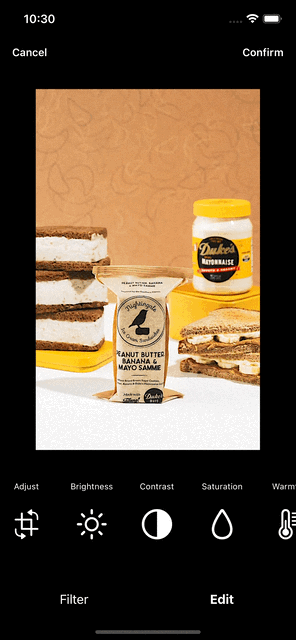

# CZImageEditor

An image editor that can apply preset filters passed to it and customized editings to a binded image. Customized editings include rotation, zooming, cropping, brightness, contrast, saturation, warmth, and sharpen.

## Features

### Preset Filters
You can pass your own preset filters to the `CIImageEditor`. They should conform to `CIFilter`. By default, four built-in filters will be used: Normal (original), Crystal, Vivid, and Air.

### Adjust Image
User can adjust the image by rotating, zooming, and cropping. The edge of the image will be aligned automatically to make sure the cropping frame stays in the range of image.

### Custom Editings
User can adjust the image's brightness, contrast, saturation, warmth, and sharpen in the **edit** pannel.

### Different Shape of Cropping Frame
You can preset the cropping frame to the editor. There are five options: image's original shape (default), 4 : 3, 1 : 1, 3 : 4, circle.

### Keep Track of Changes
All changes and the orginal image will be saved separately. So these changes won't lose when the editor is dismissed. When user reopen the editor again, they have option to revert all changes or apply new changes on the latest version. See Usage section for more details.

### Localization
You have the option to apply localization string to this editor. You can set a localization prefix string to all shown text in editor's UI. 

### Callback clousure
You can add an optional callback clousure which will be excuted when user confirmed the changes made to the image.


## Preview

   Preset Filters     |         Rotation and Crop      |       Custom Editing       |
:-------------------------:|:-------------------------:|:-------------------------:
  |    |  

## Usage

### Parameters
Only two required parameters are image and parameters. All other parameters have default values.

  * **image**: A binding to the image about to be edited.
  * **parameters**: A binding to a group of parameters that contains the original image and all possible changes have been made to the image.
  * **frame**: What frame shape you want to use. By default, it is the same shape of editing. You can also choose 4 by 3, square, 3 by 4, and circle.
  * **filters**: The preset filters that can be chosen by user to apply to the image. These filters should conform to `CIFilter`.
  * **filterNameFont**: Text font applies to the preset filter name
  * **thumbnailMaxSize**: The maximium length of the thumbnail of the image used during editing.
  * **localizationPrefix**: A prefix string that attached to all text shown on the screen.
  * **actionWhenConfirm**: An optional clousure that excutes when user confirm the changes to the image.

### Keep Track of Changes
This editor uses a struct called `ImageEditorParameters` to keep track of the changes made to the image, so users get chance to revert the changes them made. You should create and keep this struct along with the `CZImageEditor` when you use this editor.

### Example
The following example shows a typcial scenario of how this editor should be used in your code.

```swift
   struct ContentView: View {
       @State private var image = UIImage(named: "testImage")!
       @State private var showImageEditor = false
       @State private var savedImageEditorParameters = ImageEditorParameters()
       @State private var yourOwnFilters: [CIFilter] = [...] // your own preset filters (optional)

       var body: some View {
           VStack {
               Image(uiImage: image)
                   .resizable()
                   .scaledToFit()
                   .onTapGesture {
                       showImageEditor = true
                   }
           }
           .frame(width: 200, height: 300)
           .fullScreenCover(isPresented: $showImageEditor) {
               CZImageEditor(image: $image, parameters: $savedImageEditorParameters, filters: yourOwnFilters)
           }
       }
   }
```
## Installation

Add a package by selecting `File` → `Add Packages…` in Xcode’s menu bar.

Search for the CZImageEditor using the repo's URL:
```console
https://github.com/KaiyiZhao/CZImageEditor.git
```
